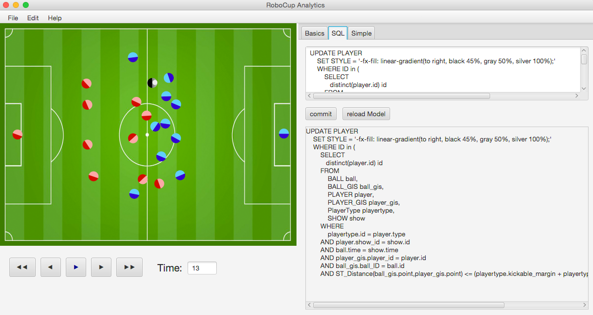
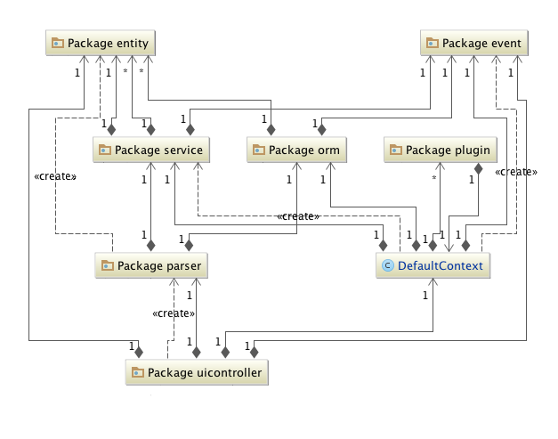
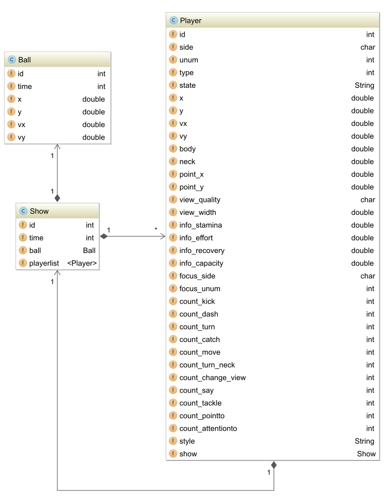
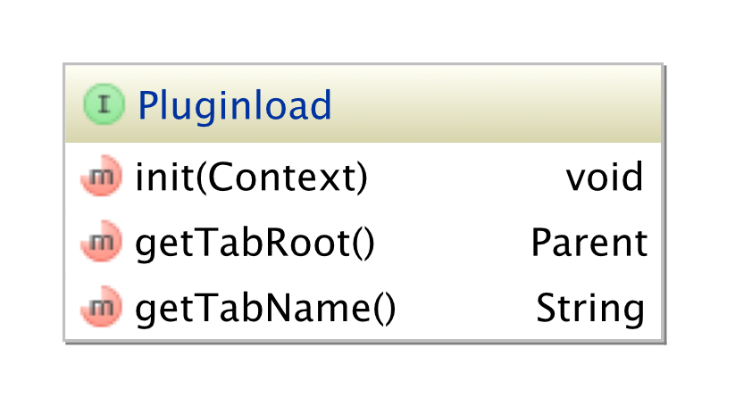

# Robocup Analytics

Simple Java Tool to replay and analyse Rocbocup 2D Games from Log-files

## Getting Started

You can Download the packed zip in misc and run the jar file or clone the repository and build the jar by your self

Here you can find the [Log-files](http://chaosscripting.net/files/backup_socsim_robocup_org/2D/log/)

### Installing

Clone this repository and run maven install

### Contribution

Feel free to work on this Project

### UML

**packages**

**class diagramm entitys**

**plugin interface**

## Built With

* [Maven](https://maven.apache.org/) - Dependency Management

## Authors

* **Erfan Nazmehr** - *Initial work* - [ErfanNazmehr](https://github.com/illiano)

## License

This project is licensed under the MIT License
